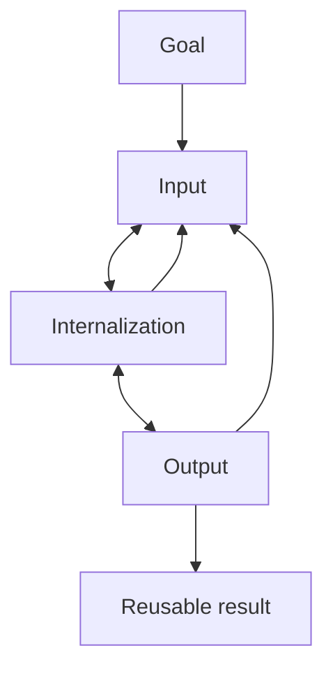

# obs-Timothy

`obs-Timothy` 是一个面向 Obsidian 的中文原子笔记开源方案，包含：

- 一个用于 Codex 的技能：`obsidian-note-system`
- 一个可直接初始化知识库的母版库：`template-vault`

它的目标不是提供一套“多收集一点内容”的笔记方案，而是提供一套可复用、可治理、可初始化的中文知识工作流。

## English Summary

`obs-Timothy` is an open-source Chinese note system for Obsidian. It combines:

- a Codex skill: `obsidian-note-system`
- a reusable vault template: `template-vault`

Its purpose is to provide a repeatable workflow for structured knowledge work, not just a larger note collection.

## Structure Diagram



## 核心方法

项目使用三层工作流：

- `Input`
- `Internalization`
- `Output`

对应关系：

```text
输入 = Input
内化 = Internalization
输出 = Output
```

基本流程：

```text
目标
 ↓
输入 ←→ 内化 ←→ 输出
 ↑       ↑       ↓
 └──── 反馈与迭代 ────┘
```

核心原则：

- 先判断知识类型，再决定结构
- 一张卡只解决一个核心对象
- 不强迫所有笔记套同一个结构
- 保留 `关联知识`
- 中文简洁
- 机制优先
- 忠实原意

## 笔记结构

正式层使用 6 类母模板：

1. 对象类
2. 机制类
3. 结构类
4. 执行类
5. 证据类
6. 表达类

非正式层：

7. 素材

素材用于摘录、片段、提纲、灵感和未完成内容，不强行升格为正式知识卡。

## 项目内容

```text
obs-Timothy/
└── skills/
    └── obsidian-note-system/
        ├── SKILL.md
        ├── agents/
        ├── references/
        ├── scripts/
        └── template-vault/
```

### 1. obsidian-note-system

`skills/obsidian-note-system/` 是主 skill。

它负责：

- 初始化 Obsidian 知识库
- 创建或改写中文笔记
- 按 6 类母模板分类
- 把素材整理成正式卡
- 保持 `Input / Internalization / Output` 一致

### 2. template-vault

`skills/obsidian-note-system/template-vault/` 是母版库。

它包含：

- `00-原子笔记总纲`
- `01-母版使用说明`
- `02-快速开始`
- `Input`
- `Internalization`
- `Output`
- 收敛后的 `.obsidian` 默认配置

这个母版库只保留稳定结构、说明页和模板页，不承载具体知识内容。

## 安装

把 `skills/obsidian-note-system` 复制到你的 Codex skills 目录中，例如：

```text
~/.codex/skills/obsidian-note-system
```

## 使用

### 连接 Obsidian 与 Codex

运行：

```text
python scripts/init_obsidian_codex_bridge.py <vault>
```

默认正式知识库：

```text
C:\Users\26544\iCloudDrive\iCloud~md~obsidian
```

脚本会在知识库中创建：

```text
_Codex/
├── 00-Codex协作说明.md
├── 指令笔记.md
├── Inbox/
├── Results/
├── Archive/
└── Logs/
```

这个桥接目录用于让 Obsidian、Codex 和 `obsidian-note-system` 通过文件协议协作。

支持动作：

- `query`：查询知识库
- `create`：新增笔记
- `update`：修改笔记
- `refine`：优化笔记
- `archive`：归档笔记
- `delete`：永久删除笔记

删除规则：

- 默认执行 `archive`
- 只有明确写出 `永久删除`、`彻底删除` 或 `delete permanently` 时，才执行永久删除

### 初始化新知识库

运行：

```text
python scripts/bootstrap_obsidian_vault.py <target>
```

脚本会在目标目录下创建：

- `Obsidian`
- 或在已存在非空 `Obsidian` 时创建 `Obsidian-新建`

### 模板源优先级

初始化脚本按下面顺序查找模板源：

1. 环境变量 `OBSIDIAN_NOTE_SYSTEM_TEMPLATE_ROOT`
2. skill 目录内的 `template-vault`
3. 本机默认目录 `C:\Users\26544\Desktop\Obsidian`

### 搜索笔记

`find_obsidian_note.ps1` 支持：

- 显式传入 `-Root`
- 或使用环境变量 `OBSIDIAN_NOTE_SYSTEM_VAULT_ROOT`

示例：

```text
powershell -File scripts/find_obsidian_note.ps1 -Title "系统思维" -Root "D:\my-vault"
```

## 适用场景

- 中文原子笔记治理
- Obsidian 母版库初始化
- 素材到正式卡的结构化整理
- 在 Codex 中复用同一套笔记工作流

## 开源协议

MIT License

详细变更见 [CHANGELOG.md](./CHANGELOG.md)。  
协作方式见 [CONTRIBUTING.md](./CONTRIBUTING.md)。
